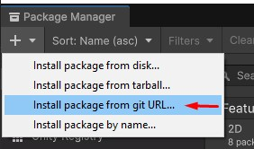
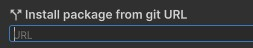
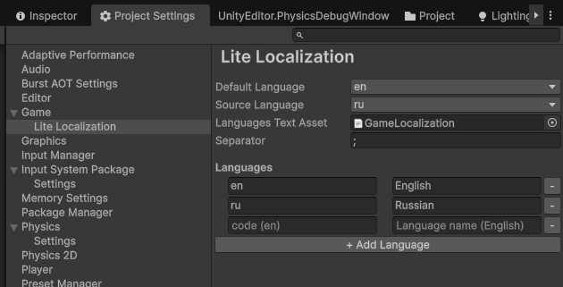
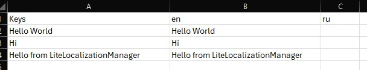

## 🌍 Lite Localization
**Lite Localization** is a lightweight package for simple and clean localization in Unity projects.  
No complex setup, no unnecessary overhead — just straightforward and transparent localization.


### Features
- Key-free system — the original text itself is the translation key
- Automatic population — missing translations are appended to the CSV file automatically
- Lightweight — minimal dependencies and overhead

### Installation


```
https://github.com/Lesuut/Lite-Localization.git
```

### Usage
1. Open **Project Settings → Game → Lite Localization**  


2. Configure the localization parameters:
   - **Default Language** — the language used when the game starts
   - **Source Language** — the language your original text is written in
   - **Languages Text Asset** — CSV file containing translations (assign an empty CSV file)

#### Adding Languages
Add supported languages in the following format: `LocaleCode - DisplayName`

Example:
- en — English
- ru — Russian
- fr — French

Where:  
The first value is the locale code (`en`, `ru`, `fr`, etc.)  
The second value is the name displayed in the language selection dropdown.

#### API
```csharp
Debug.Log(LiteLocalizationManager.Translate("Hello World"));
```
```csharp
using UnityEngine;
using TMPro;

public class DynamicText : MonoBehaviour
{
    [SerializeField] private TextMeshProUGUI textComponent;

    private void OnEnable()
    {
        LiteLocalizationManager.OnLanguageChanged += UpdateText;
        UpdateText();
    }

    private void OnDisable()
    {
        LiteLocalizationManager.OnLanguageChanged -= UpdateText;
    }

    private void UpdateText()
    {
        textComponent.text = LiteLocalizationManager.Translate("Welcome to the game");
    }
}
```
#### How It Works

Lite Localization is built around a **key-free** translation workflow:
- You call `Translate()` with a phrase written in your source language
- This original phrase is treated as the translation key
- If the translation for the active language is missing, the system automatically writes the source text into the CSV file
- As a result, you never need to create or maintain translation keys manually
